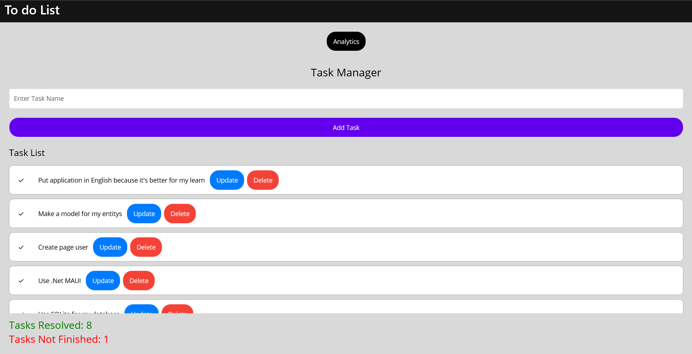
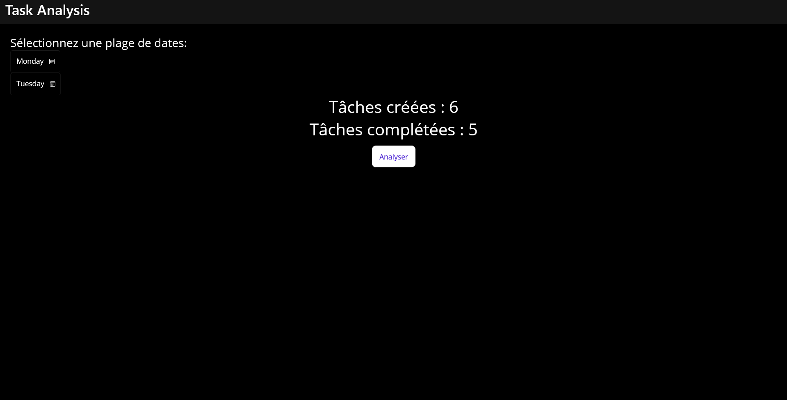

### Objectif

Créer une application de liste de tâches à l'aide de C# et .Net.

### Brief

Pour mieux organiser vos objectifs quotidiens, vous allez créer une application de liste de tâches. Pour la rendre un peu plus intéressante, vous ajouterez une fonctionnalité permettant de suivre votre progression au fil du temps ! Cela vous aidera à répondre à des questions telles que : Combien de tâches avez-vous terminées sur une période donnée ? Quel est votre jour de la semaine le plus productif ? De combien de minutes/heures/jours avez-vous besoin en moyenne pour terminer une tâche ?

### Tâches

- Implémenter l'affectation en utilisant :
- Langage : **C#**
- Framework : **.Net**
- Votre application doit conserver les données dans une base de données
- SQLite est préférable, mais vous êtes libre d'utiliser une base de données de votre choix
- Créer un modèle de tâches à effectuer. Chaque tâche doit avoir un identifiant, un nom, une date de création, une date de fin et un champ d'état uniques
- Implémentez les opérations CRUD typiques pour cette ressource
- À l'aide d'un framework Windows Presentation Foundation (WPF) ou .NET Multi-platform App UI (MAUI) :
- Créez une page qui affiche :
- Une liste des tâches de l'utilisateur avec une case à cocher pour marquer la tâche comme terminée
- Un bouton de suppression qui supprime une tâche
- Un formulaire simple pour ajouter de nouvelles tâches
- Créez une page « d'analyse » simple qui affiche le nombre de tâches créées et le nombre de tâches terminées dans un laps de temps spécifique (par défaut les 7 derniers jours). En utilisant les paramètres de requête, la page doit accepter deux plages de dates et filtrer les tâches en conséquence

